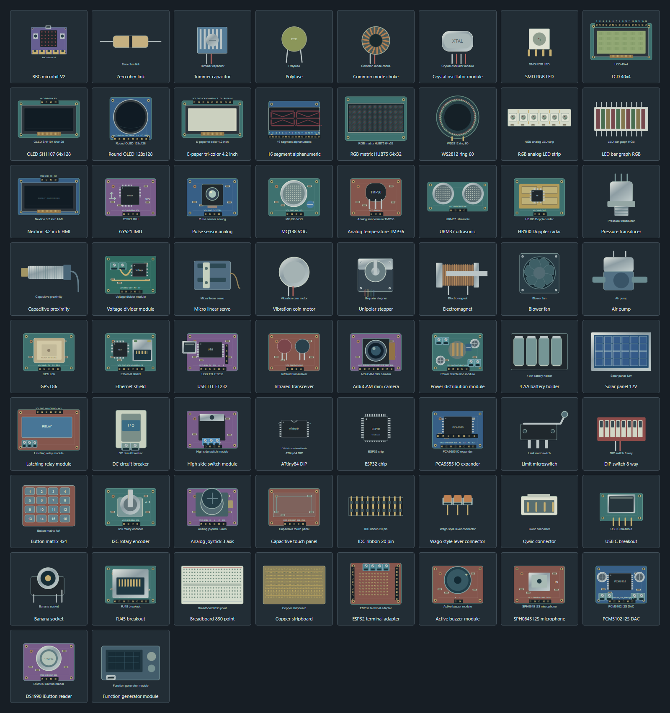
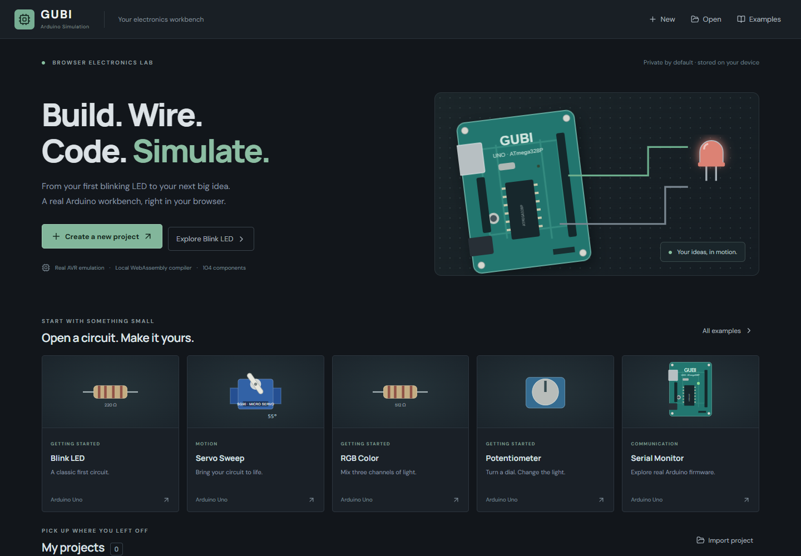
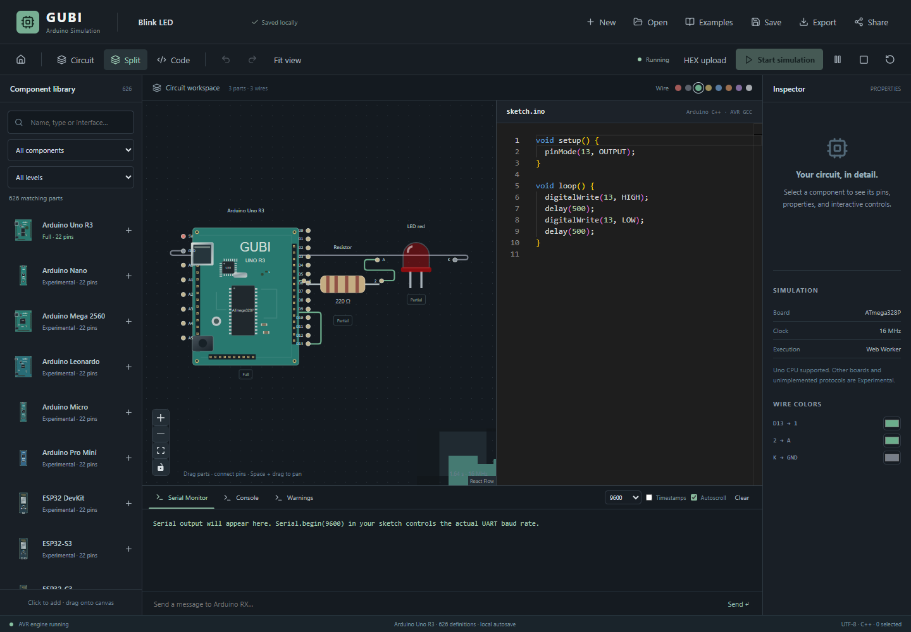

# GUBI Arduino Simulation

An independent, static-first electronics workbench built with React, TypeScript, Vite, React Flow, Zustand, Monaco, IndexedDB, AVR8js, and a browser AVR GCC WebAssembly toolchain. No proprietary simulator API, copied Wokwi visuals, development backend, account, or environment variable is required.

## Run

Use Node **22 or 24** and npm.

```sh
npm install
npm run build
npm run dev
```

The build copies compiler tools, Arduino headers, and compiled library objects from the pinned npm dependency into `public/avr`, then builds `dist`. Compiler assets are generated dependencies, not committed duplicates. The first compilation downloads roughly 55 MB from your own static host; a cold build takes longer than subsequent cached loads. Stop cancels compilation. Compilation has a 90 second timeout, and diagnostics appear in Console. No remote compilation service is used.

## Workbench

- Dashboard with local projects and 20 circuit starters.
- 626 registry definitions across 15 categories, including 42 boards. Every definition displays its actual support level.
- 626 individually addressable SVG component models authored for GUBI; virtualized library with name/interface search, category and support filters, click to add, drag onto the grid, rotation, duplicate, delete, pin wiring, wire colors, pan, zoom, minimap, selection, and context menu.
- Circuit, Code, and Split modes. Local Monaco editor with Arduino C++ highlighting.
- Start, Pause/Resume, Stop, Reset; real firmware compilation and Intel HEX upload.
- GPIO driven LED and RGB brightness, physical servo pulse decoding, closed button/switch nets, ADC input sliders.
- Serial TX and RX, clear, display baud selector, autoscroll and timestamps.
- Project name editing, JSON import/export, file based sharing, one second debounced IndexedDB autosave, saved project dashboard.
- Undo/redo (50 history snapshots). Ctrl+C/V/D/Z/Y/S/A; Delete; Space+drag pan; wheel zoom. Copying multiple parts also copies their internal wires. Shortcuts defer to text editors while typing.
- Global error boundary, worker crash reporting, bounded serial output, malformed project and firmware validation.

Click **New**, add LED red and Resistor, wire Uno D13 → resistor 1, resistor 2 → LED A, and LED K → Uno GND. The default Blink sketch compiles and blinks the physical LED. The **Servo Sweep** starter uses the actual Arduino Servo library and D9 pulses. **Serial Monitor** prints `Hello GUBI` and echoes incoming RX bytes.

## Architecture

```text
src/app/              Shell, dashboard, inspector, error boundary
src/circuit/          React Flow editor, pins, SVG renderers
src/components/       Typed component registry
src/editor/           Locally bundled Monaco editor
src/assets/components/ Original SVG assets
src/examples/         Circuits and editable Arduino code
src/hooks/            Simulation lifecycle / worker messaging
src/store/            Zustand project history and IndexedDB
src/simulator/        CPU adapter, worker, compiler, netlist, HEX parser
src/utils/            Project validation and export
src/types/            Shared project and simulator contracts
scripts/              Compiler asset copy and browser QA
```

`compileSketch` runs the upstream GCC build in a disposable module Worker. The result is Intel HEX with checksum and size validation. A separate simulation Worker instantiates the ATmega328P CPU, GPIO ports B/C/D, timers 0/1/2, ADC, and USART0. It executes actual AVR instructions and clock events. A 20 ms simulated slice produces a batched snapshot. GPIO high time determines brightness, while rising/falling edges measure servo pulses independently of snapshot boundaries. A union-find netlist connects component pins, including closed contacts and functional resistor paths. Interactive changes update the worker netlist and ADC without restarting the CPU.

UI project state and simulation snapshots are separate. Heavy compilation and CPU execution never run on the React thread. The editor is lazy loaded so the dashboard does not need its initial payload.

## Support matrix

Support labels describe the implemented models, not full analog circuit fidelity.

| Board or device | Level | Implemented behavior |
| --- | --- | --- |
| Arduino Uno R3 / ATmega328P | Full CPU | AVR instructions, GPIO, external interrupts from GPIO, hardware timers, PWM, ADC, UART; Arduino core implements millis/micros/delay |
| Nano, Mega, Leonardo, Micro, Pro Mini, ESP boards, Pico boards | Experimental | Editable visual definitions and pins only; Start refuses unsupported boards |
| Five LED colors | Partial | Connected anode/cathode, GPIO and time averaged PWM brightness |
| RGB common cathode / anode | Partial | Three independent channels and common terminal polarity |
| Resistor | Partial | Series connectivity; resistance value stored/displayed; no current solver |
| SG90 / standard servo | Partial | Powered connection, 544–2400 µs pulse width mapped to 0–180° |
| Push button, toggle / slide switch | Partial | Interactive ideal contact closure and Arduino INPUT_PULLUP |
| Potentiometer, LDR, photoresistor modules | Partial | Powered 0–1023 adjustable ADC input |
| All remaining catalog devices | Experimental | Visual/pin/project support only; no device protocol or output behavior |

**Working starters (9):** Blink, Button LED, RGB Color, Servo Sweep, Potentiometer, Traffic Light, PWM LED, LDR Automatic Light, Serial Monitor.

**Experimental starters (11):** Ultrasonic, DHT11, LCD, buzzer, 7 segment, PIR, joystick, NeoPixel, relay, DC motor, stepper. These intentionally identify missing behavior, rather than presenting a fake simulation.

## Known limitations

- This is a functional digital simulator, **not SPICE**. Resistors provide connectivity; Ohm's law, current, capacitor charge, diode curves, pull-down resistor networks, and destructive electrical behavior are not solved. A warning checks directly wired power-to-ground nets. Other circuit faults may remain undetected.
- Only one Uno CPU is accepted. Other boards have their own illustrative board models, but their experimental pin metadata and CPU emulation do not reproduce the complete hardware.
- Device models for I2C/SPI/OneWire, displays, DHT, ultrasonic, WS2812, motors, and other Experimental catalog devices remain future work. Linking a library does not imply that its external device is simulated.
- The Arduino sketch is compiled as C++ with `Arduino.h` prepended. Arduino IDE automatic function prototype generation and multi-file sketches are not implemented. Define functions before use or provide prototypes. Only the toolchain's bundled headers and precompiled libraries are available; arbitrary library installation is not offered.
- Host speed determines wall-clock simulation speed. The CPU runs with the correct 16 MHz simulated clock but makes no hard real-time guarantee. UI updates are batched at approximately 50 Hz.
- Serial display baud selection is informational; the sketch's `Serial.begin` sets actual emulated UART baud. RX follows the configured hardware character timing. Timestamp display uses the current simulation snapshot and is not a retained per-character trace.
- Project sharing exports a portable file; hosted share links, accounts, cross-device cloud sync, and collaborative editing are not implemented. IndexedDB is origin-local and may be cleared by browser storage policies.
- Editor and UI have a mobile fallback, but dense circuit editing remains desktop oriented. Every catalog item has its own SVG asset. Related devices share drawing helpers, while packaging, probes, screens and connectors identify their physical family.

## Component models

All 626 catalog entries have an original SVG in `src/assets/components/catalog/`: 8×8 matrix pixels, segmented displays, LCD/OLED screens, sensor packages, board footprints, motors, power devices, DIP ICs and breadboards. 522 new entries cover development boards, passives, OLED/TFT/e-paper, LED matrices and rings, environment/motion/optical/gas sensors, actuators, radios, power converters, numbered-lead ICs, input controls, connectors, prototyping, audio, storage and instruments. The same models appear in the library, canvas and inspector. Servos and switches use separate base SVGs under their live animation overlays. Display graphics show physical hardware, not invented simulation output. Existing project ids and pin ids are preserved. Expanded parts use illustrative interface-level wiring, not manufacturer-specific physical pinouts; package ICs expose numbered leads. Pin spacing grows with lead count, including the 100-lead ATmega2560 package. New entries remain Experimental until their behavior is implemented.

```sh
# Node 22.18+ or 24; regenerate the checked-in original vectors
npm run artwork:generate
# With the Vite development server running
npm run test:models
npm run test:catalog
```

Reusable geometry lives in `scripts/artwork/`, organized by component family. The expansion uses 66 physical drawing families with per-device packaging, labels, pixel/lead counts and colors. Adding a definition requires a matching SVG; the model resolver deliberately rejects missing models instead of silently rendering a generic rectangle. Unit checks cover all 626 entries and count the physical 64 pixels in both matrix variants. Browser QA parses all 626 SVGs and verifies image loading, checks MAX7219 in the canvas and inspector, exercises each expanded drawing family on the canvas, checks the end of the virtual list and filtering, and validates dense wiring handles. Simulation support labels are independent of artwork coverage.



[All 626 component models](docs/component-models.png)

Interface references: [Adafruit STEMMA specifications](https://learn.adafruit.com/introducing-adafruit-stemma-qt/technical-specs), [TI logic IC documentation](https://www.ti.com/product/SN74HC595), and [ST inertial sensor documentation](https://www.st.com/resource/en/datasheet/lsm6ds3tr-c.pdf). Drawings are original interface illustrations rather than exact manufacturer footprints.

## Add a component

For an illustrative component, extend `src/components/expandedCatalog.ts` and `scripts/artwork/expanded.mjs`, then run `npm run artwork:generate`. For a functional device, add a definition to `src/components/registry.ts`, with unique `id`, category, pin ids/types, visual, default properties, interactive controls, documentation and support level. Add SVG assets/rendering in `PartVisual.tsx` as needed. Implement real pin/net behavior in the simulation engine and meaningful regression tests **before** changing its support label from Experimental. Every project wire stores explicit component ids and pin ids.

Project JSON format is versioned:

```json
{"version":1,"id":"project-id","name":"My circuit","board":"arduino-uno-r3","code":"...","components":[],"wires":[],"simulatorSettings":{"frequency":16000000},"updatedAt":0}
```

## Validation

```sh
npm test
npm run typecheck
npm run lint
npm run build
```

Unit tests cover registry uniqueness, project import/export, each starter, resistor nets, short warnings, button closure, HEX validation, true machine-code execution, disconnected LED behavior, ADC controls and pulse decoding. Checked-in GCC firmware fixtures exercise Blink timing, hardware timer PWM duty, the actual Servo.h timer ISR, and real UART TX/RX through AVR8js.

With a running development server and Microsoft Edge installed:

```sh
node scripts/browser-check.mjs
node scripts/layout-check.mjs
```

The browser suite compiles locally, watches Blink change, measures moving servo angles, verifies `Hello GUBI` and RX echo, and rejects browser runtime errors. Set `TEST_URL` to test a production origin, or set `GENERATE_FIXTURES=1` to regenerate regression firmware fixtures against the development server. It uses Playwright headless Edge; change its `channel` to your installed Chromium browser if necessary.

## Cloudflare Workers Static Assets (Wrangler)

This repository uses Workers Static Assets, not Pages redirect rules. `public/_redirects` has been removed because the catch-all rewrite can trigger infinite loop validation. `wrangler.jsonc` configures `assets.directory: ./dist` and `not_found_handling: single-page-application`.

```sh
npm run build
npm run deploy:check
npx wrangler deploy
```

`deploy:check` runs a dry run without uploading. A real deployment requires Cloudflare login or an API token with Workers permissions. Build automation should run `npm run build`, then `npx wrangler deploy`. `/studio`, `/projects`, and `/examples` receive the SPA shell on direct navigation and refresh. `/studio` opens the workbench, `/projects` opens the dashboard, and `/examples` opens the example picker.

See [Cloudflare SPA routing documentation](https://developers.cloudflare.com/workers/static-assets/routing/single-page-application/).

Run `npx wrangler dev --local --port 8787` followed by `node scripts/deployment-check.mjs` to verify direct route navigation and refresh using the actual local Workers asset runtime.

### If using Cloudflare Pages separately

Connect this GitHub repository to Cloudflare Pages:

| Setting | Value |
| --- | --- |
| Framework preset | Vite |
| Production branch | main |
| Build command | npm run build |
| Build output directory | dist |
| Root directory | Repository root |
| Node | 22 or 24 (package.json engines) |
| Environment variables | None required |

Do not recreate the catch-all `_redirects` file. The checked-in Wrangler configuration is the canonical Workers deployment configuration. Worker, Monaco, compiler JavaScript, WASM, headers and objects are all served by the same static origin. WASM must be served as `application/wasm`; Cloudflare handles the `.wasm` extension. No production URL points to localhost. All individual compiler files are below Cloudflare's 25 MiB static file limit. Use HTTP compression and caching for compiler assets; do not cache mutable project JSON in a shared cache. Deploying the repository is separate from this source delivery: this project does not create or configure a Cloudflare account automatically.

## Screenshots




## Research and third-party software

- [AVR8js](https://github.com/wokwi/avr8js) — MIT, actual CPU/peripheral emulator. Its open source emulation code is used; no proprietary API or Wokwi visual assets are used.
- [AVR GCC WASM](https://github.com/horang-corp/avr-gcc-wasm) — browser compiler package pinned in the lockfile, carrying GCC, binutils, avr-libc, Arduino core and bundled libraries. This was selected over a backend-dependent compilation pipeline after reviewing its browser worker API and static asset contract.
- [Third party notices](THIRD_PARTY_NOTICES.md) describe upstream licenses and corresponding source references. Compiler/Arduino assets have their own GPL/LGPL and other licenses; the application's MIT license does not replace them.

Review upstream license/source distribution obligations when redistributing toolchain binaries, especially modified versions. The build copies the complete upstream notices to `/avr/THIRD_PARTY_NOTICES.md` as well.
